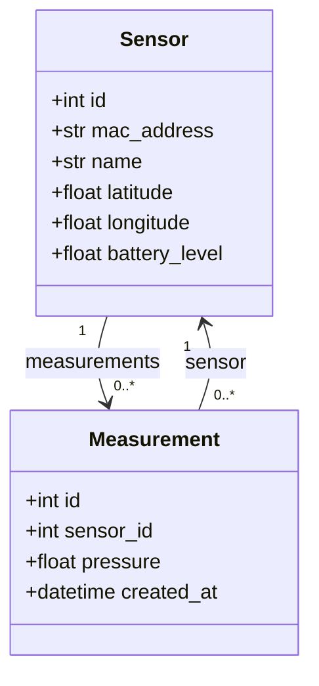

# UML Class Diagram

The backend uses SQLModel models for `Sensor` and `Measurement`. A sensor can have many measurements, while each measurement belongs to exactly one sensor.

## Relationship Summary

- `Sensor.id` is the primary key of the sensor table.
- `Measurement.sensor_id` is a foreign key to `Sensor.id`.
- The ORM relationship is declared with `Relationship(back_populates=...)` in both models.