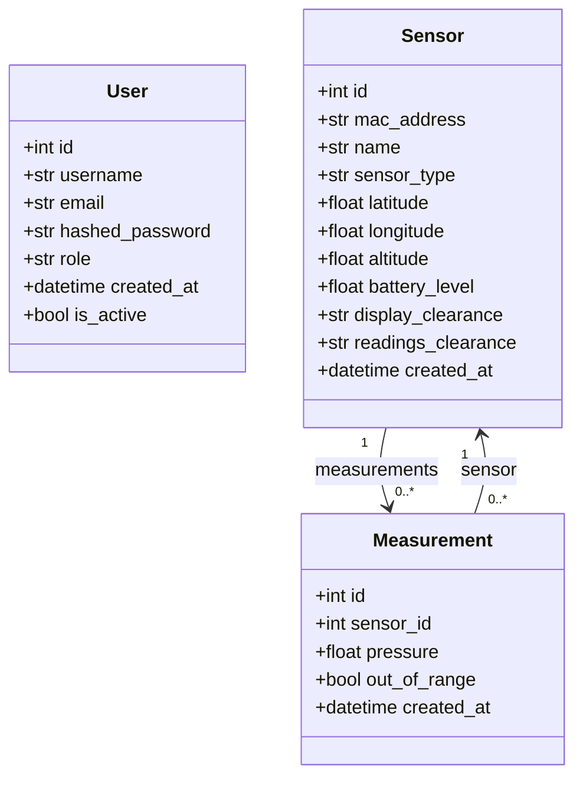

# UML Class Diagram

The backend uses SQLModel models for user authentication, sensor management, and measurement storage. Users have roles that determine what sensors and measurements they can access based on clearance levels. Sensors can be either physical devices or software simulators.

## Field Descriptions

### User Model
- `username`: Unique identifier for login (minimum 3 characters)
- `email`: User email address (must be valid format)
- `hashed_password`: Bcrypt-hashed password
- `role`: One of [guest, regular, elevated, full_clearance, top_secret]
- `is_active`: Soft delete flag for account deactivation

### Sensor Model
- `mac_address`: Unique MAC address (AA:BB:CC:DD:EE:FF format) - primary identifier for MQTT
- `name`: Human-readable sensor name
- `sensor_type`: One of ["physical", "simulator"]
  - **physical**: Real hardware device connected via MQTT
  - **simulator**: Virtual sensor generating synthetic pressure data
- `latitude`/`longitude`: Geographic coordinates
- `altitude`: Height above sea level in meters
- `battery_level`: Battery charge (0.0 = 0%, 1.0 = 100%)
- `display_clearance`: Required role to see sensor on map/list
- `readings_clearance`: Required role to access measurement data
- `created_at`: Timestamp when sensor was created

### Measurement Model
- `sensor_id`: Foreign key to Sensor - which sensor recorded this measurement
- `pressure`: Measured pressure in hPa (hectopascals)
- `out_of_range`: Boolean flag if pressure exceeds expected range
- `created_at`: Timestamp when measurement was recorded

## Relationship Summary

- `User.id` is the primary key of the users table. Users are authenticated via username/password.
- `Sensor.id` is the primary key of the sensors table. Sensors are created via dashboard UI or direct database insertion.
- `Measurement.sensor_id` is a foreign key to `Sensor.id`.
- Each sensor has two independent clearance fields that work with user roles to control access.
- User roles form a hierarchy: `guest` → `regular` → `elevated` → `full_clearance` → `top_secret`
- The ORM relationships are declared with `Relationship(back_populates=...)` in both models.
- Simulator sensors store their configuration in both the database and `simulator_config.json` file for auto-startup.