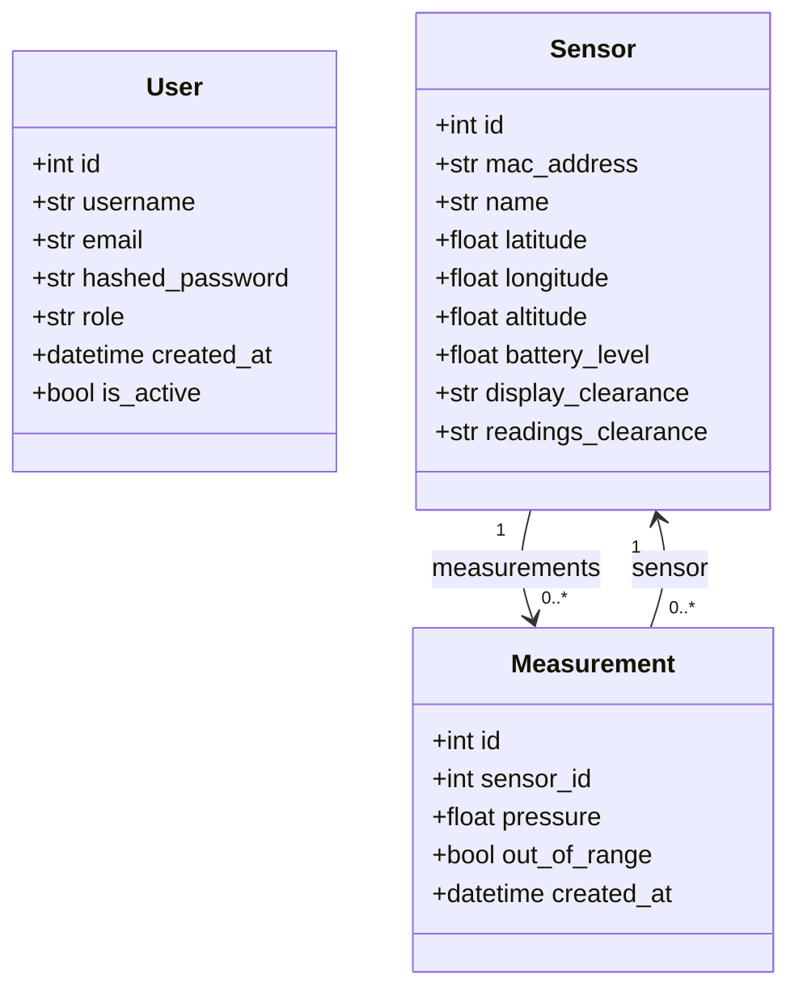

# UML Class Diagram

The backend uses SQLModel models for user authentication, sensor management, and measurement storage. Users have roles that determine what sensors and measurements they can access based on clearance levels.

## Relationship Summary

- `User.id` is the primary key of the users table. Users are authenticated via username/password.
- `Sensor.id` is the primary key of the sensors table.
- `Measurement.sensor_id` is a foreign key to `Sensor.id`.
- Each sensor has two clearance fields:
  - `display_clearance`: Controls visibility in the dashboard map and sensor list
  - `readings_clearance`: Controls access to measurement data (pressure values, battery level, altitude)
- User roles determine access levels: `guest` → `regular` → `elevated` → `full_clearance` → `top_secret`
- The ORM relationships are declared with `Relationship(back_populates=...)` in both models.