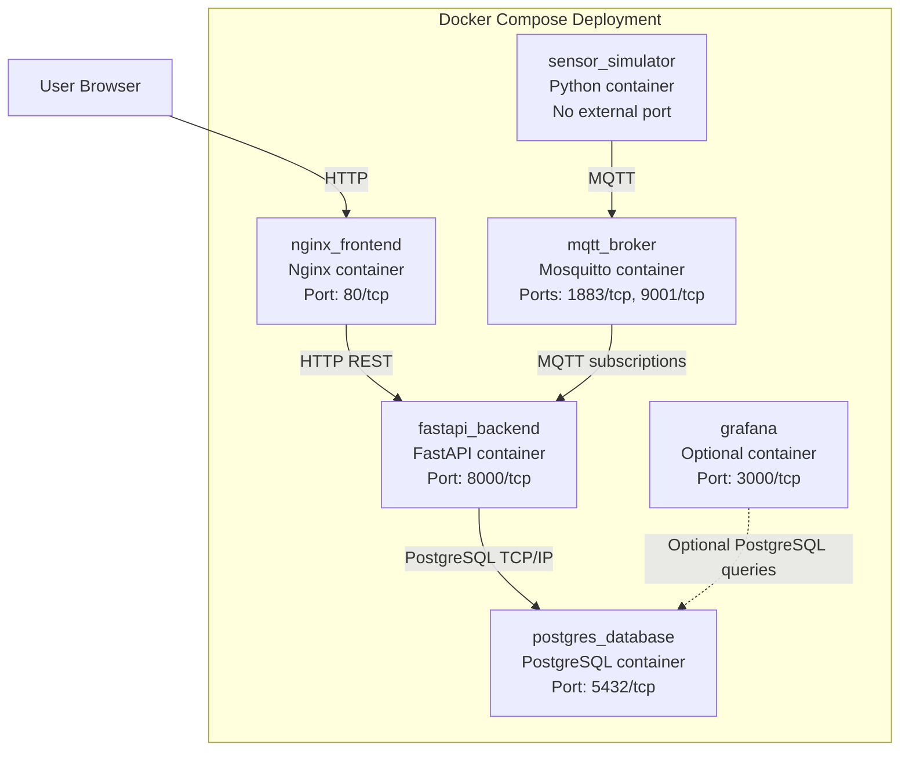

# UML Deployment Diagram

The system is deployed as a Docker Compose application with five active containers. Grafana is not currently part of the stack, but it is shown as an optional extension because it is allowed by the assignment.

## Communication Summary

- Browser to frontend: HTTP
- Frontend to backend: HTTP REST
- Simulator to broker: MQTT
- Broker to backend: MQTT subscriptions
- Backend to PostgreSQL: TCP/IP using PostgreSQL protocol
- Optional Grafana to PostgreSQL: TCP/IP using PostgreSQL protocol