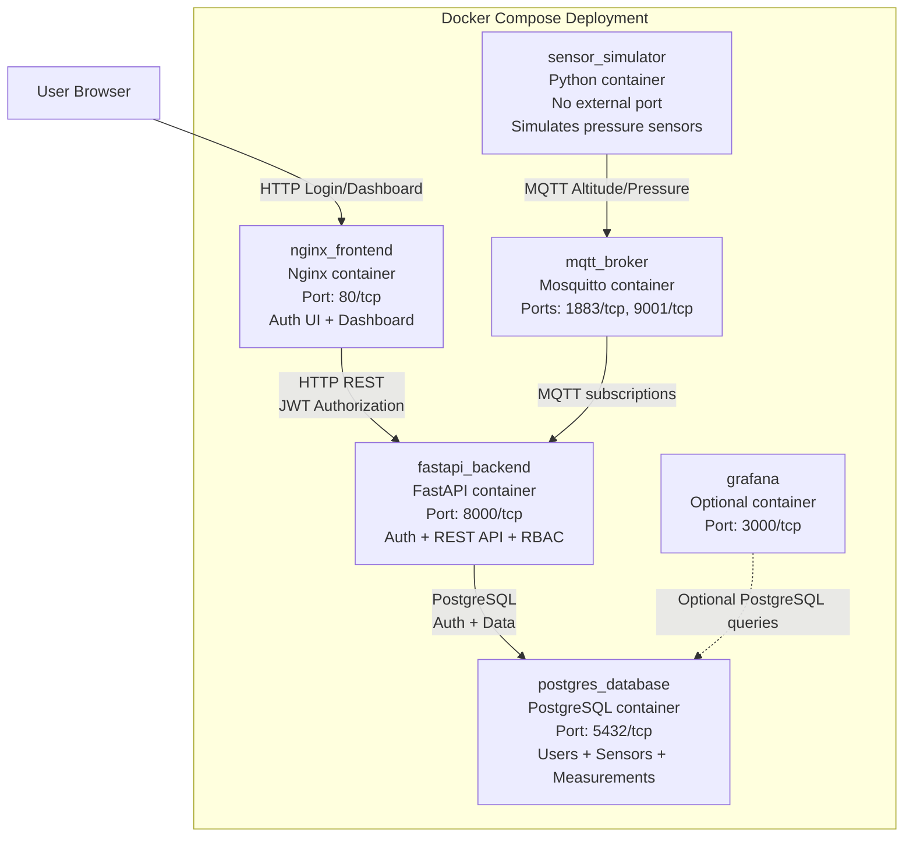

# UML Deployment Diagram

The system is deployed as a Docker Compose application with five active containers. The frontend and backend now include user authentication with role-based access control.

## Communication Summary

- **Browser to frontend**: HTTP with session/JWT persistence
- **Frontend to backend**: HTTP REST with Bearer token authorization
- **Simulator to broker**: MQTT publishing sensor data (pressure, altitude, battery)
- **Broker to backend**: MQTT subscriptions for measurement and sensor status
- **Backend to PostgreSQL**: TCP/IP using PostgreSQL protocol for all user, sensor, and measurement data
- **Frontend authentication**: Login/register screens with role-based dashboard access
- **Optional Grafana**: Can query PostgreSQL for metrics and visualization