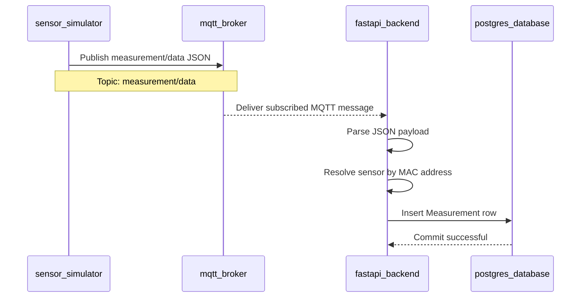

# UML Sequence Diagram

This sequence describes the required measurement data flow from simulated device publishing through persistence in the database.

## Included Processing Steps

- The simulator emits a pressure value and timestamp.
- The broker receives and forwards the MQTT message.
- The backend subscriber parses the payload and resolves the owning sensor.
- The backend stores the measurement persistently in PostgreSQL.