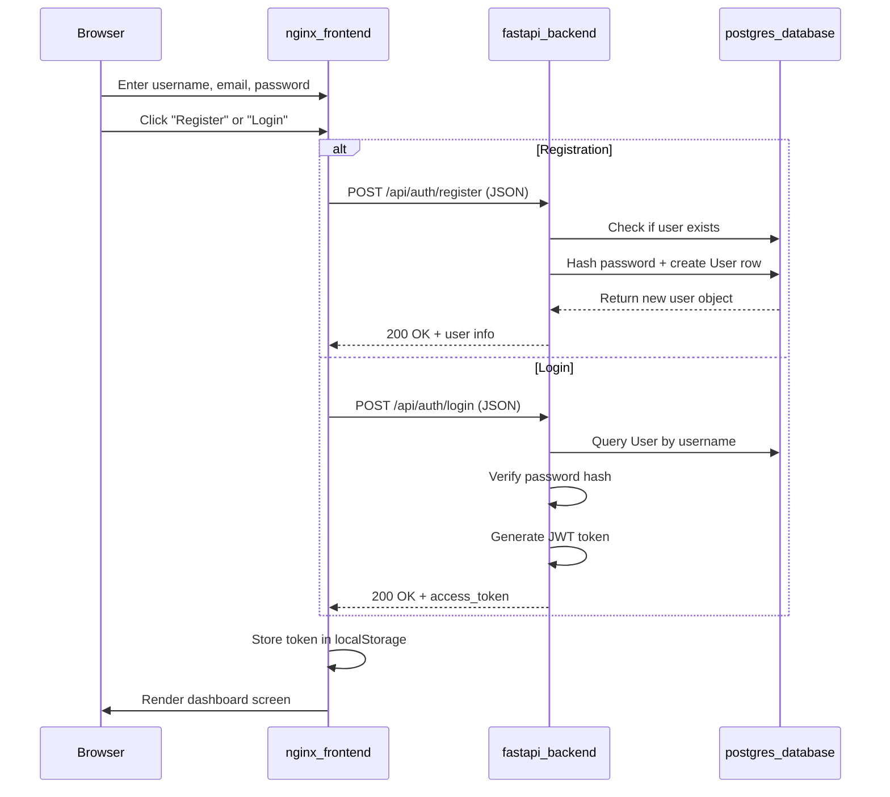
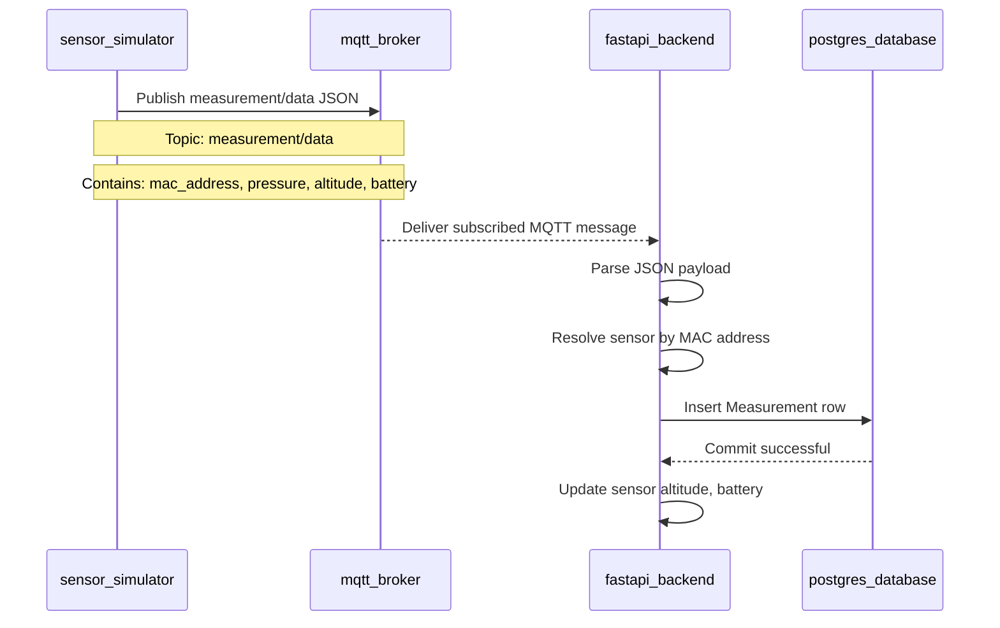
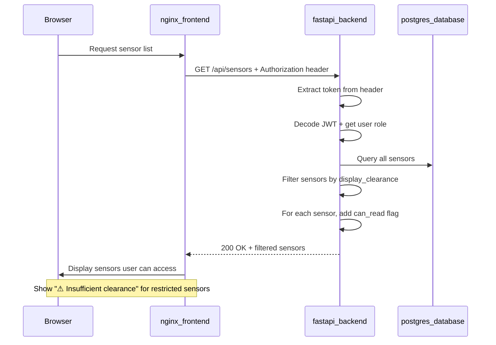

# UML Sequence Diagrams

## 1. User Authentication Flow

## 2. Measurement Data Flow

This sequence describes the measurement data flow from simulated device publishing through persistence in the database.

## 3. Dashboard Data Access (Role-Based Filtering)

## Included Processing Steps

**Authentication**:
- User submits registration or login form with JSON body (no python-multipart required)
- Backend validates credentials and generates JWT token
- Token is returned and stored in browser localStorage
- Token is included in Authorization header for subsequent requests

**Measurement Flow**:
- Simulator publishes pressure, altitude, and battery level via MQTT
- Backend receives MQTT messages and resolves sensor by MAC address
- Measurements are persisted with timestamp
- Sensor altitude and battery level are updated in real-time

**Dashboard Access**:
- User JWT token determines their role (guest, regular, elevated, full_clearance, top_secret)
- Sensors have two independent clearance levels: display_clearance and readings_clearance
- Backend filters sensors based on user role vs. sensor display_clearance
- Measurements are only visible if user role exceeds readings_clearance
- Frontend UI shows "---" for data the user cannot access