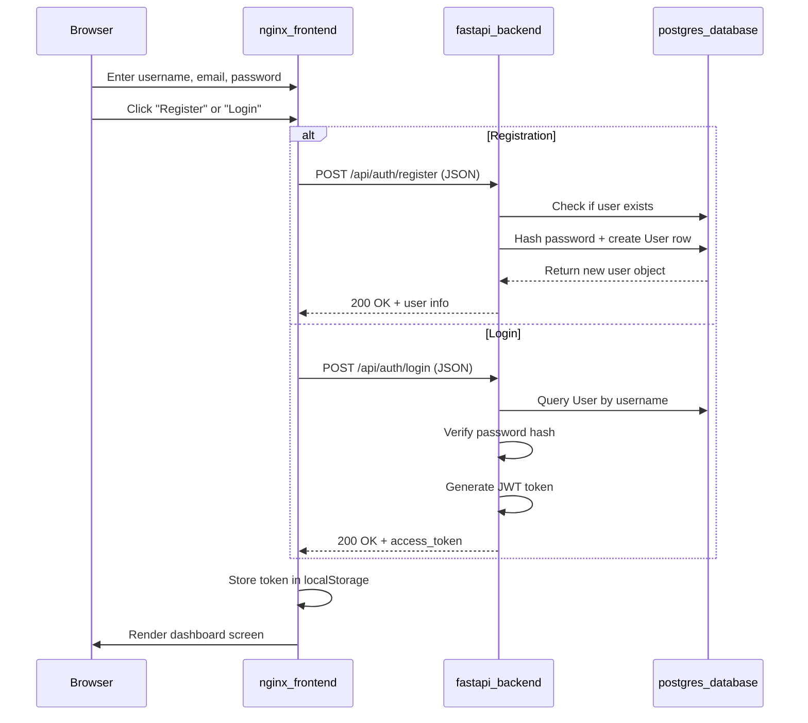
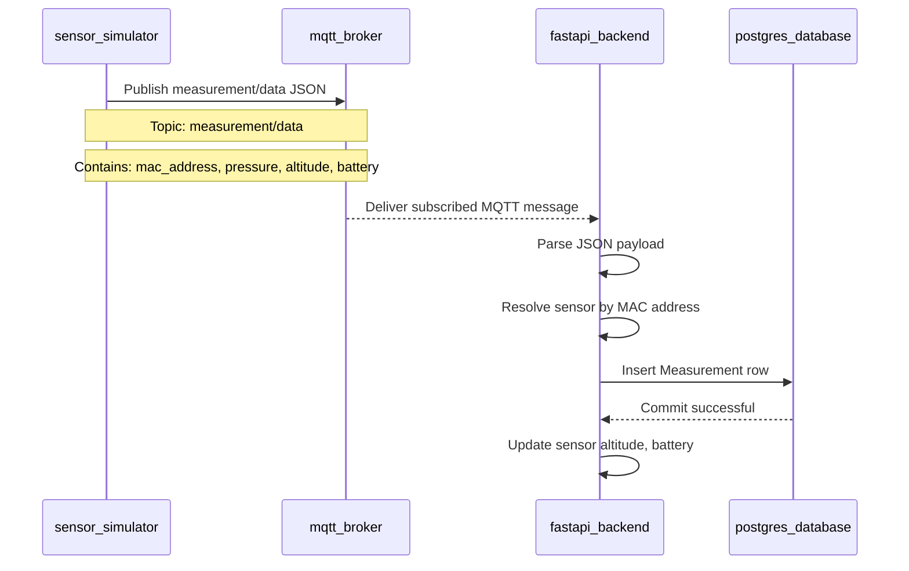
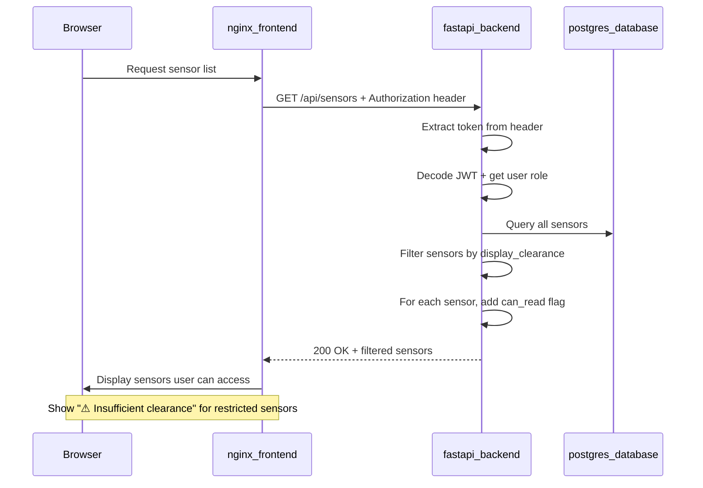
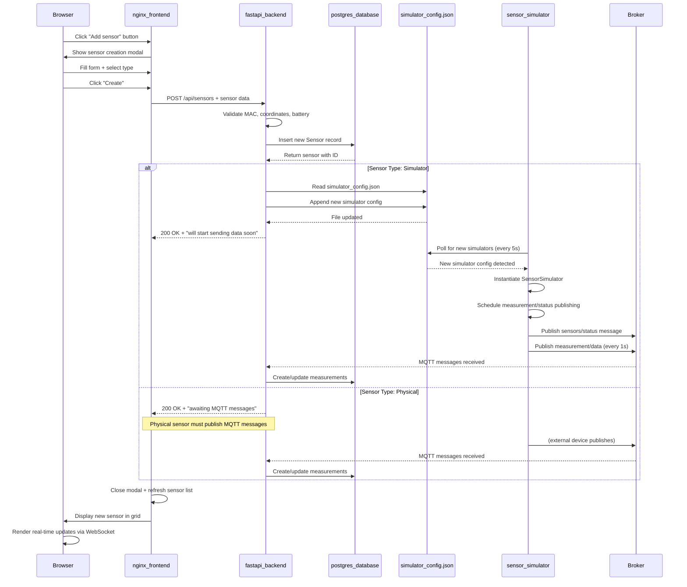
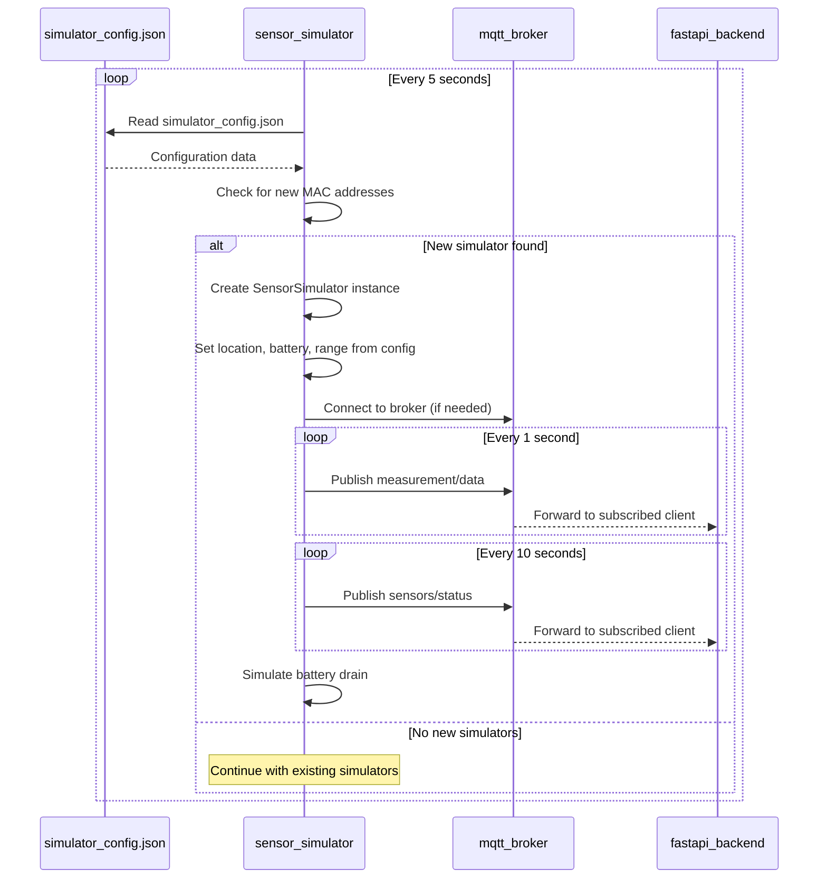

# UML Sequence Diagrams

## 1. User Authentication Flow

## 2. Measurement Data Flow

This sequence describes the measurement data flow from simulated device publishing through persistence in the database.

## 3. Dashboard Data Access (Role-Based Filtering)

## Included Processing Steps

**Authentication**:
- User submits registration or login form with JSON body (no python-multipart required)
- Backend validates credentials and generates JWT token
- Token is returned and stored in browser localStorage
- Token is included in Authorization header for subsequent requests

**Measurement Flow**:
- Simulator publishes pressure, altitude, and battery level via MQTT
- Backend receives MQTT messages and resolves sensor by MAC address
- Measurements are persisted with timestamp
- Sensor altitude and battery level are updated in real-time

**Dashboard Access**:
- User JWT token determines their role (guest, regular, elevated, full_clearance, top_secret)
- Sensors have two independent clearance levels: display_clearance and readings_clearance
- Backend filters sensors based on user role vs. sensor display_clearance
- Measurements are only visible if user role exceeds readings_clearance
- Frontend UI shows "---" for data the user cannot access

## 4. Sensor Creation Flow

This sequence describes creating a new sensor from the dashboard, supporting both physical and simulator types.

## 5. Simulator Configuration Update

The sensor_simulator service periodically checks for new simulator configurations and starts them automatically.

## Processing Details

**Sensor Creation**:
- Form validates: MAC address format, coordinate ranges (-90/+90, -180/+180), battery 0-100%, pressure min < max
- User must have authentication token (Bearer token in Authorization header)
- Simulator sensors are added to both database and JSON config file
- Physical sensors only added to database (assume external MQTT publisher)
- Clearance levels determine who can see/read the sensor

**Simulator Auto-Start**:
- sensor_simulator service runs in loop checking config file every 5 seconds
- No container restart required - new simulators detected and started automatically
- Configuration includes: MAC, location, altitude, battery level, expected pressure range
- Simulator generates realistic pressure measurements following a normal distribution
- Battery drains slowly with each transmitted message

**Message Publishing**:
- Measurements (measurement/data): Once per second, contains pressure value
- Status (sensors/status): Every 10 seconds, contains battery level and location
- Both include MAC address for identification and clearance levels for access control